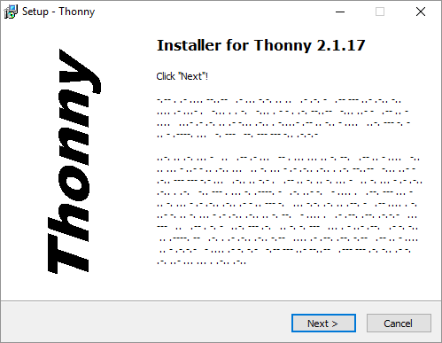
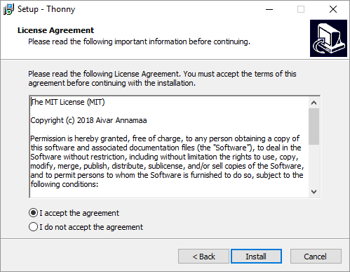
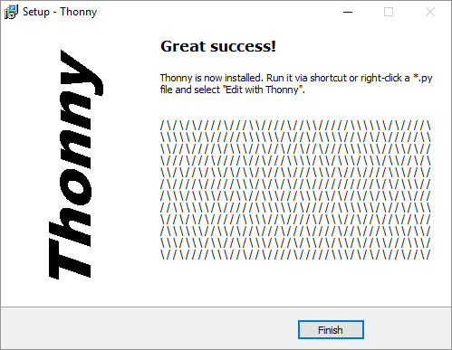

***

# Installing Thonny

I will be using the program Thonny during class time to work through programming tasks.

## 1 - Download Thonny

Thonny can be downloaded for Windows or Mac computers. 

1. Go to the website [Thonny.org](www.thonny.org).
1. Select which computer type you have (Windows or Mac).  
1. There is a download link to the top right of the main webpage.

### 1.1 - Windows Install

- **The first step in the install process will display the following, just click the next button.**

- **Accept the agreement and click on Install**

- **The final step will be the following, click on Finish**

**You will see the Thonny application icon on the your computer**

### 1.2 - Mac Install

- **Download the Mac DMG file**

- **Goto to the Download folder on your Mac and run the Thonny DMG file**

- **Copy the Thonny program to the desktop or to your Applications folder**

- **Run Thonny.  You might get a warning about running a program from the Internet.**

## 2 - That's it!
